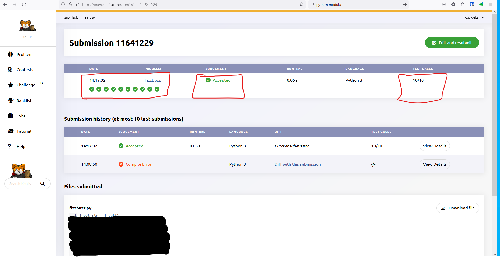

# Home Assigment 1 - FizzBuzz
FizzBuzz is a simple programming problem that is used as a challenge or for interviews. 
We will use Kattis this time to challenge you. Kattis is a web site that hosts multiple programming problems and challenges, it allow you to post your solution as code in many languages and get immidiate results. You will need to create an account (using your gmail is the most recommended option)

# Deadline 
Sunday, the 8th of October

# How to send me the solution

- Email me (weiss_gal@yahoo.com) a screenshot of your submission (like the one I put below)
- Email me the code

# Instructions 
- Go to Kattis web site and sign up (use the login option at the left-upper corner) - [Kattis web site](https://open.kattis.com/)
- Go to the FizzBuzz problem page and carefully read the problem definition include the examples, make sure you understand what you need to do - [Fizzbuzz problem](https://open.kattis.com/problems/fizzbuzz)
- After you know the problem it is recommended that you will try to solve it locally on your computer (using python and IDLE), you can also post your solution directly, but I don't recommend doing so because it will not give you enough information if you do something wrong.
- After you solved the problem you can submit your solution in two ways
  - upload the python (.py) file using the **Upload Files** button
  - Choose **Python 3** from the dropdown and then **Start Coding** button, then copy paste your solution
- Use the **Submit** button to check your solution. Don't worry if you have a mistake - you can submit again and again.

If you submitted 100% correct solution you should see the below screen, if not it will either tell you that you have a compilation problem (something wrong with the code) or that you didn't address all use cases, which means your code is valid, but there is a certain input that when provided to your code will yield an incorrect result. 

Also, please do not use ChatGPT or similar tools, you can look up functions and ideas in the internet, but write the code yourself, the purpose is to get you to refresh your python skills, not to check if some AI can solve this problem. 



## Problems and tips 
# how to read the input line
you didn't learn it yet, but the following command will take a string like "1 2 7" and put the numbers into the variables x, y and n as integer (מספר שלם)

```
input_str = "1 2 7"
x, y, n = map(int, input_str.split())
```

# Minimal output 
make sure that your code only output is the results, nothing else, no extra lines, no instructions for the user. the Kattis site is expecting just the result, nothing else. 
